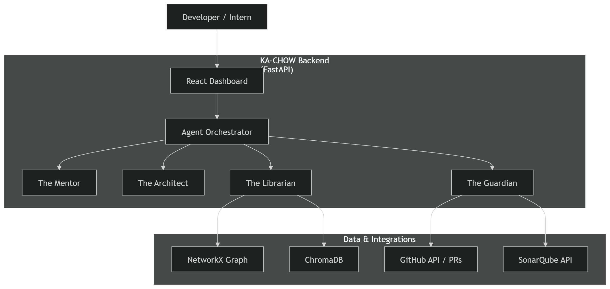

# ⚡ KA-CHOW: The Autonomous Engineering Brain

> **"The Staff Engineer that Never Sleeps."**  
> An intelligent, agent-driven platform that eliminates the "Enterprise Memory Gap" by continuously ingesting code, requirements, and metrics into a Living Knowledge Graph.

[](https://www.python.org/downloads/release/python-3110/)
[](https://fastapi.tiangolo.com/)
[](https://reactjs.org/)
[](https://www.llamaindex.ai/)
[](https://www.sonarqube.org/)

---

## 🛑 The Problem: The "Enterprise Memory Gap"
In modern software development, system knowledge is completely fragmented. Jira holds the *plan*, but the code holds the *reality*. Because these silos don't connect, enterprises suffer from:
*   **Stale Documentation:** Wikis become "lies" the moment new code is pushed.
*   **The Onboarding Tax:** New hires spend weeks on information scavenger hunts.
*   **Architectural Drift:** What was planned slowly deviates from what is actually built.
*   **Invisible Tech Debt:** Developers make changes without understanding the true "blast radius" of their code.

## 🚀 The Solution: A Multi-Agent Squad
**KA-CHOW** is not just a semantic search tool. It is a **Multi-Agent System** powered by LlamaIndex and Groq that acts as a real-time, autonomous Staff Engineer. 

### 🤖 Meet the Squad (Core Features)

#### 1. The Architect (Autonomous Scaffolding & Impact Analysis)
*   **System Scaffolding:** Interprets natural language (e.g., "Build a ride-sharing backend") and instantly scaffolds production-ready, layered microservices (FastAPI, Docker, K8s).
*   **API-Aware "What-If" Analyzer:** Uses deterministic AST (Abstract Syntax Tree) parsing to calculate the exact "Blast Radius" of a proposed code change, preventing production outages before code is written.

#### 2. The Librarian (Ingestion & System Health)
*   **Living Knowledge Graph:** Continuously ingests Code, Jira tickets, and Slack context to map interlinked nodes of Services, APIs, and Schemas.
*   **System Health Dashboard:** Integrates with **SonarQube** to display real-time metrics on Technical Debt, Code Smells, and Documentation coverage.

#### 3. The Mentor (Omnichannel Q&A & Onboarding)
*   **Intent-First Q&A:** RAG-powered chat that answers architectural questions with precise file citations.
*   **Contextual Onboarding :** Filters the Knowledge Graph by role (Backend/Frontend) to create dynamic reading lists.
*   **Gamified Learning Paths:** Pulls real "Code Smells" from SonarQube and assigns them as "Starter Quests" for fresh interns.
*   **Timeline Slider:** A "Time-Machine" using Git history to visualize how the architecture has evolved or drifted over time.

#### 4. The Guardian (CI/CD Enforcer & Self-Healing)
*   **Standards Enforcer:** Intercepts Pull Requests. If SonarQube detects low health or missing documentation, the merge is blocked ("No Docs, No Merge").
*   **Autonomous Self-Healing:** Identifies fragile patterns, uses LLMs to write the missing code/docs, generates an Architecture Decision Record (ADR), and automatically opens a new GitHub PR with the fix.

---

## 🏗️ System Architecture



## 🛠️ Tech Stack
 ### Frontend:
    React.js + Tailwind CSS (Glassmorphism Cyber-Engineering UI)
    Axios for API communication
 ### Backend:
    Python 3.11 + FastAPI (Async API Routes)
    LlamaIndex (ReAct Agent Orchestration & RAG)
    Groq API (Llama-3-70b) (Lightning-fast LLM reasoning)
    NetworkX + AST (Deterministic Dependency Graphing)
    ChromaDB (Local Vector Storage)
### Integrations:
    SonarQube (Code Quality & Metrics)
    GitPython & PyGithub (Timeline & CI/CD Automation)

### ⚙️ Local Setup & Installation
 ### 1. Prerequisites
    Python 3.11+
    Node.js v18+
    Docker (for local SonarQube)
    Groq API Key
    GitHub Personal Access Token
 ### 2. Environment Variables
    Create a .env file in the backend/ directory:
    code
    env
    GROQ_API_KEY=your_groq_api_key
    GITHUB_TOKEN=your_github_token
    SONAR_TOKEN=your_sonarqube_token
 ### 3. Start the Backend
    cd backend
    python -m venv venv
    source venv/bin/activate  # On Windows: venv\Scripts\activate
    pip install -r requirements.txt

    Run the FastAPI server
    uvicorn app.main:app --reload --port 8000


   
### 4. Start the Frontend
    cd frontend
    npm install
    npm start

## 5. Start SonarQube (Optional but recommended for full features)
code
Bash```
docker run -d --name sonarqube -p 9000:9000 sonarqube:lts-community```