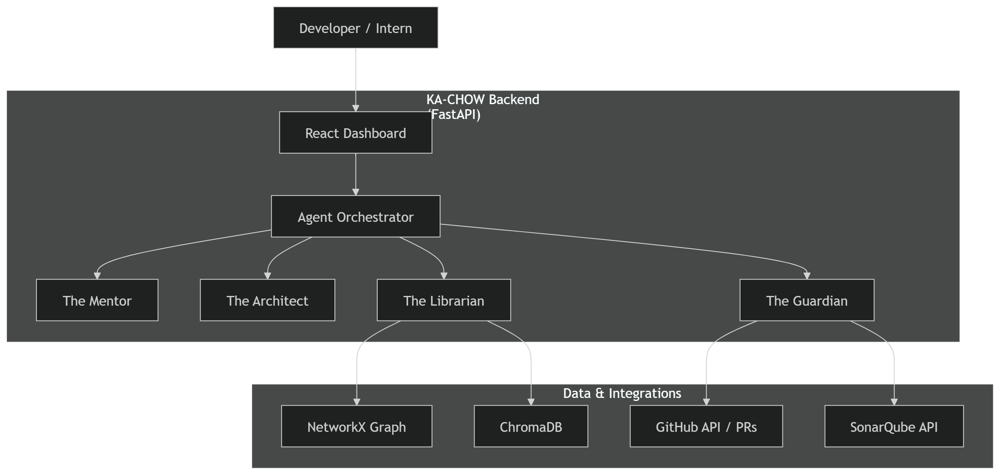

# ⚡ KA-CHOW: The Autonomous Engineering Brain

> **"The Staff Engineer that Never Sleeps."**  
> An intelligent, multi-agent platform that eliminates the "Enterprise Memory Gap" by continuously ingesting code, requirements, and metrics into a Living Knowledge Graph.

---

## 🛑 The Problem: The "Enterprise Memory Gap"
In modern software development, system knowledge is fragmented. Jira holds the *plan*, but the code holds the *reality*. These silos lead to:
*   **Stale Documentation:** Wikis become outdated the moment code is pushed.
*   **The Onboarding Tax:** New hires spend weeks hunting for information.
*   **Architectural Drift:** Planned architecture deviates from the implementation.
*   **Invisible Tech Debt:** Changes are made without understanding the local "blast radius".

## 🚀 The Solution: A Multi-Agent Squad
**KA-CHOW** is a **Multi-Agent System** powered by LlamaIndex and Groq (Llama-3.3-70B) that acts as a real-time, autonomous Staff Engineer.

### 🤖 Meet the Squad (Core Features)

#### 1. 🏗️ The Architect (Impact Analysis & Scaffolding)
*   **API-Aware "What-If" Analyzer:** Uses deterministic AST (Abstract Syntax Tree) parsing to calculate the "Blast Radius" of proposed changes.
*   **Intelligent Scaffolding:** Interprets natural language to scaffold layered microservices (FastAPI, Docker, K8s).

#### 2. 📚 The Librarian (Ingestion & Knowledge Graph)
*   **Living Knowledge Graph:** Continuously maps Services, APIs, and Schemas from Code, Jira, and Slack.
*   **Repository Processing:** Automated AST parsing and vectorization of entire codebases.

#### 3. 🛡️ The Guardian (CI/CD Enforcer & Self-Healing)
*   **Standards Enforcer:** Blocks PRs if SonarQube detects low health or missing documentation ("No Docs, No Merge").
*   **Autonomous Self-Healing:** Identifies fragile patterns, writes missing code/docs, and opens "Self-Healing" PRs.

#### 4. 🎓 The Mentor (RAG Q&A & Onboarding)
*   **Intent-First Q&A:** RAG-powered chat answering architectural questions with precise file citations.
*   **Gamified Onboarding:** Creates dynamic reading lists and "Starter Quests" based on real code smells.

#### 5. 📊 The PM & 🖼️ The Diagrammer
*   **PM Agent:** Manages tasks and tracks technical debt progress.
*   **Diagram Agent:** Generates real-time Mermaid visualizations of system architecture and logic flows.

---

## 🏗️ System Architecture

## 🛠️ Tech Stack
 ### Frontend:
    React.js + Tailwind CSS (Glassmorphism Cyber-Engineering UI)
    Axios for API communication
 ### Backend:
    Python 3.11 + FastAPI (Async API Routes)
    LlamaIndex (ReAct Agent Orchestration & RAG)
    Groq API (Llama-3-70b) (Lightning-fast LLM reasoning)
    NetworkX + AST (Deterministic Dependency Graphing)
    ChromaDB (Local Vector Storage)
### Integrations:
    SonarQube (Code Quality & Metrics)
    GitPython & PyGithub (Timeline & CI/CD Automation)

### ⚙️ Local Setup & Installation
 ### 1. Prerequisites
    Python 3.11+
    Node.js v18+
    Docker (for local SonarQube)
    Groq API Key
    GitHub Personal Access Token
 ### 2. Environment Variables
    Create a .env file in the backend/ directory:
    code
    env
    GROQ_API_KEY=your_groq_api_key
    GITHUB_TOKEN=your_github_token
    SONAR_TOKEN=your_sonarqube_token
 ### 3. Start the Backend
    cd backend
    python -m venv venv
    source venv/bin/activate  # On Windows: venv\Scripts\activate
    pip install -r requirements.txt

    Run the FastAPI server
    uvicorn app.main:app --reload --port 8000

   
### 4. Start the Frontend
    cd frontend
    npm install
    npm start
